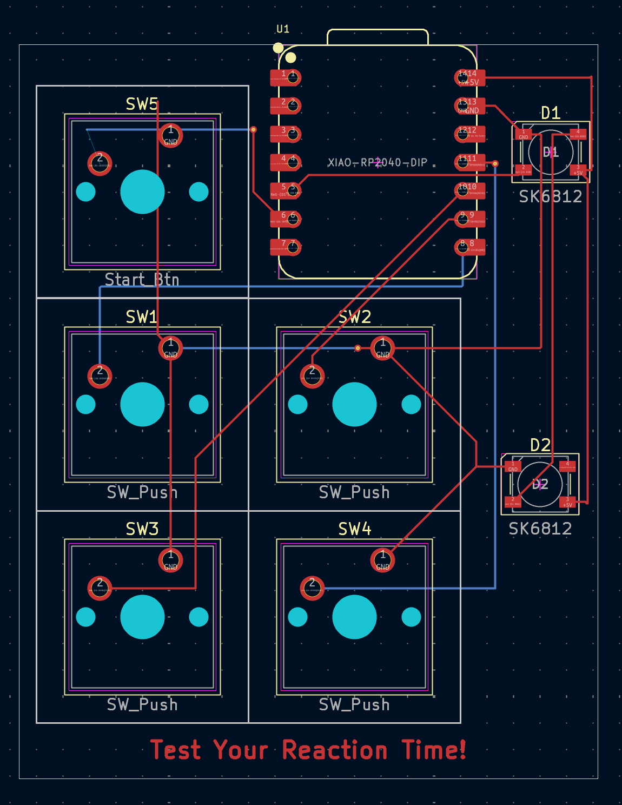
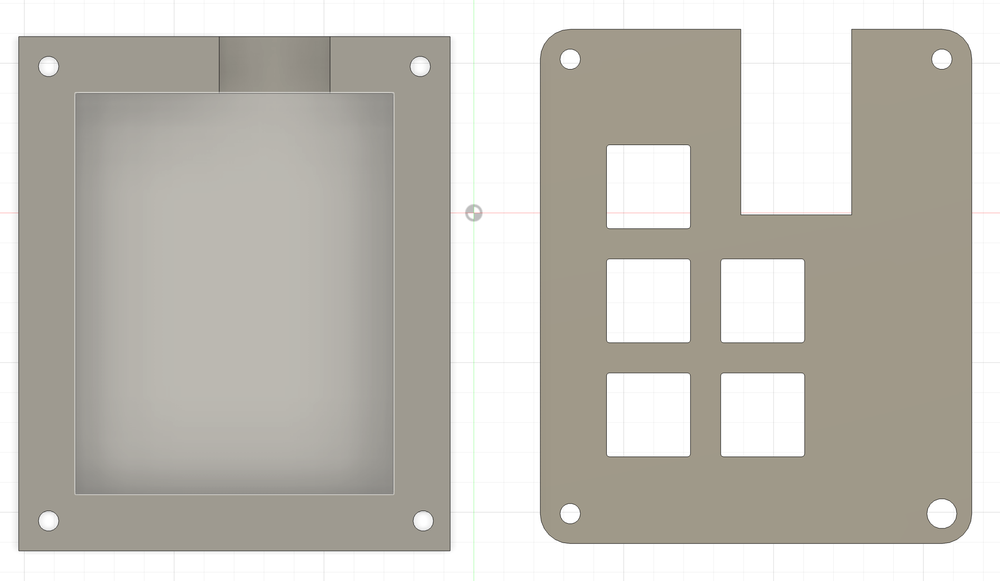

## Anish's Reaction Tester Game

**Inspiration:**
I used to play with the game bop it when I was a kid and that was a game that would test my reaction time, when I saw this macropad all the different buttons reminded me of the game, so I decided to do the same. 

**Challenges:**
Some challenges I faced, this was the first time I had ever done circuit CAD whether it was a schematic or the PCB on KiCad. It was definitely a new experience that taught me how much more there is to designing something that may seem so simple as a keyboard. 

**Specifications:**
5x Cherry MX Switches
2x SK6812 MINI Leds
1x XIAO RP2040
5x Blank DSA Keycaps
4x M3x16 Bolt

##Anish's Reaction Time Tester
| Schematic | PCB Design | 3D Case |
| :---: | :---: | :---: |
|  |  |  |
